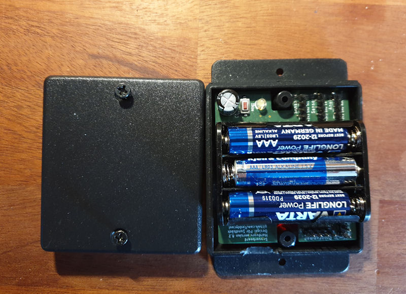

# Sensordevice

A simple generic circuit with example software for a battery powered ESP8266-07.
The circuit can handle one-wire, DHTs and all kinds of I2C sensors. It has capabillities to measures the status of the battery to know  when charging or replacement is needed. The hardware has all pull-ups and pull-downs needed for the different interfaces as well as an onewire tempsensor and an i2c HSM circuit. 

# The Hardware:

The device hardware comes in two flavours:

HW7.1 (left): Powered by 1 1500mAh LiPo and have a built-in charger. Perfect for sensors where charging now and then is an option. The circuitboard is optimised for a FB-29 box

HW8.2 (right): Powered by 3 AAA alkaline batteries. Perfect for sensors that should have a long life-time without battery change and measures rather seldom. The circuitboard is optimised for a FB-29 box.

Since everything will fit i a small enclosure and can be used without any external power supply for long a time, it is well suited for different small sensors or IoT devices. 

image::20200407_090953.jpg[Hardware version 7 and 8]

Hardware 7 and 8.

Hardware 8 in a FB-29 box

There is a also a start for HW9 wich is intended for a power-supply using one AA battery and a 'booster' for ultra low losses. It's a work in (slow) progress so far...

# Software:
Example of software for a device using 2 one-wire temperature gauges and sends information to backend each hour.

## Backend:
Example of html, php, json and sql needed to create some charts with the data.
Data is inserted in a database table using a simple php script, extracted and mangled to json in an other php script and drawn with google chart javascript in the html file.

